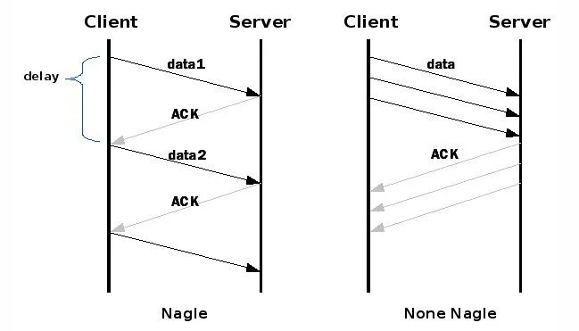

## 网络相关命令：

### netstat

```
netstat -ano 查看所有端口状态
netstat -ano | grep "8004" 查看8004端口状态
```

 


## TCP相关

tcp的发送缓存

tcp的半连接队列

tcp的全连接队列

Nagle Algorithm的问题

 为了解决tcp中传输小包的问题，例如每次传输一个字符，tcp如果也马上发到网络中，效率比较低（因为tcp的header最少也是20字节，还需要对方为了这一个字节回复一个ack，而这个ack又有可能在网络中丢失）TCP总是希望尽可能的发送足够大的数据。（一个连接会设置MSS参数，因此，TCP/IP希望每次都能够以MSS尺寸的数据块来发送数据）。Nagle算法就是为了尽可能发送大块数据，避免网络中充斥着许多小数据块。

 若设置这个算法，最晚会等待200ms，frame才会发出去（所以想想，对于一个get/post请求，有可能需要等待200ms,才能发出去，那么是不是可以关闭这个算法，可以节约200ms，但这可能会引起网络阻塞的）

TCP调优 ： https://blog.liu-kevin.com/2021/01/04/linuxzhi-wang-luo/

linux中关于tcp的文档

https://man7.org/linux/man-pages/man7/tcp.7.html

### tcp的流量控制

#### 滑动窗口流量控制

发送缓存，接受缓存，发送窗口

窗口为调整为0情况（见下面的坚持计时器）

拥塞控制：

基于是否能收到ack确认，动态调整拥塞窗口。

（1）慢开始算法

（2）拥塞避免算法

（3）快重传：发送方尽快发送，而不是一定等到重传定时器超时再重传

（5）快恢复：（见下图5号）


#### tcp的可靠传输：

（1）窗口控制

（2）ack确认机制

​			累计确认

​			捎带确认

```
ack = seqNum + length + 1 表示我已经成功收到了seqNum + length的数据，期望收到的序列号为ack
```

（3）超时重传

超时时间的确定（RTO）：基于RTT时间的平均加权计算

### tcp中的定时器：

有定时器的原因：因为在网络是非常脆弱的，客户端机器随时可能停机，进程随时可能被杀掉，网络中的路由也可能崩溃，服务器机器也有可能崩溃重启，进程也可能暂停，所以在这样的情况下，必须要有个机制保持双方可以正常沟通（除了使用定时器，似乎没有其他更好的方式了）

#### （1）保活定时器（tcp keep-alive）

目的：探测对方是不是正常，是不是不可达，是不是已经崩溃，是不是崩溃后重启。就像微服务中服务的提供方需要定期通过心跳方式告诉对方自己活着。

​    如果一个给定的连接在2hour内没有任何动作，服务器会给客户发送一个探测文段。客户主机可能的所有状态：

- 主机正常运行，而且从服务器可达-----正常

- 主机已经崩溃，关闭，或正在重启-----服务器会认为客户端已经关闭，并终止连接。服务器会收到“连接超时”

- 主机已经崩溃，并重新重启-----客户端发送RST复位响应，服务器会收到“连接被重置”

- 主机正常运行，而且从服务器可达-----路由器会回复客户端ICMP报文，告诉“网络不可达”

- 配置

  ```
  tcp_keepalive_intvl (integer; default: 75; since Linux 2.4)
                The number of seconds between TCP keep-alive probes.
  
  tcp_keepalive_probes (integer; default: 9; since Linux 2.2)
                The maximum number of TCP keep-alive probes to send before
                giving up and killing the connection if no response is
                obtained from the other end.
  
  tcp_keepalive_time (integer; default: 7200; since Linux 2.2)
                The number of seconds a connection needs to be idle before
                TCP begins sending out keep-alive probes.  Keep-alives are
                sent only when the SO_KEEPALIVE socket option is enabled.
                The default value is 7200 seconds (2 hours).  An idle
                connection is terminated after approximately an additional
                11 minutes (9 probes an interval of 75 seconds apart) when
                keep-alive is enabled.
  ```

  

#### （2）坚持定时器

问题：当tcp的窗口尺寸变为0时，如何办

#### （3）超时重传定时器


### tcp的nagle算法与delayed ACK

（1）nagle算法 如果tcp中的负载特别小，假设每次1,2个字节，那么网络可能会变的非常拥塞，nagle算法就是为了阻止这种情况发生的。

（2）delayed ACK ：一般情况下tcp接受到数据之后并不会马上返回ack，而是要等到本侧有发送的数据时一起发送，简称 “数据夹带ack”

nagle算法(默认是开启的)：当tcp发送一个小于MSS的数据时候，必须要等到ack的确认，才能发送下一个包。

```
Nagle's algorithm is a means of improving the efficiency of TCP/IP networks by reducing the number of packets that need to be sent over the network.
```

当nagle算法关闭，意味着来数据就会把它发出去。



## DNS相关

## IP相关

### TSL相关

使用wireshark看tsl： https://www.jianshu.com/p/a3a25c6627ee

### IPV4

linux系统中 

```
cat /etc/services 可以看到所有提供的服务，不如可以看到22端口是ssh服务
```


### IPV6


