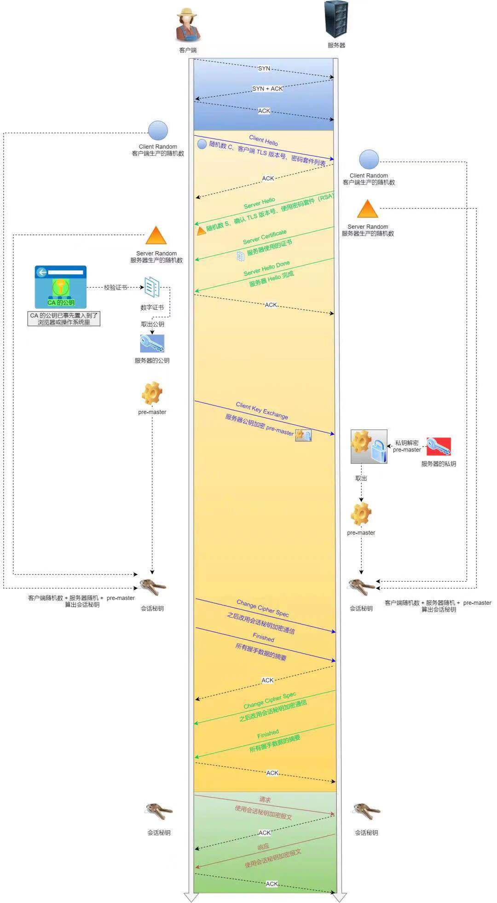

## 为什么要有tsl？

以为tcp是明文在网络中传输的，所以第三方完全有可能监听，篡改发送方的数据，这太不安全了

下文是TSl的基本流程

（1）第一步，客户端得到服务器的证书（证书里面有服务器的公钥），得到之后与预置在自己地方的证书验证，验证不通过，结束。

（2）第二步，客户解析证书，得到服务器publicKey，使用此公钥加密一个随机数。

（3）第三步，客户端和服务器分别使用三个随机数生成一个随机密码，记为secretKey，并通告对方以后使用这个secretKey进行通信。

（4）第四步，双方使用secretKey加密原始数据，进行通信。

